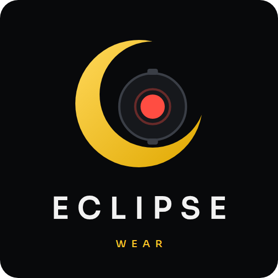

<p align="center"></p>

# Eclipse Wear

Record your Wear OS watch screen, and move files between your watch and phone.

Three apps that work together:
| App | Goes on | Download |
|---|---|---|
| **Eclipse Wear Record** | your watch (Wear OS 3 or newer) | [`[Eclipse] WearRecord v14.1.apk`](https://github.com/Squad1996/Eclipse-Releases/raw/main/%5BEclipse%5D%20WearRecord%20v14.1.apk) |
| **Eclipse Wear Companion** | your phone (Android 8 or newer) | [`[Eclipse] WearCompanion v15.2.apk`](https://github.com/Squad1996/Eclipse-Releases/raw/main/%5BEclipse%5D%20WearCompanion%20v15.2.apk) |
| **Eclipse Wear Transfer** | your watch (Wear OS 3 or newer) | [`[Eclipse] WearTransfer v2.1.apk`](https://github.com/Squad1996/Eclipse-Releases/raw/main/%5BEclipse%5D%20WearTransfer%20v2.1.apk) |


Tested on a Samsung Galaxy Watch8 Classic.

## What it does

- Records the watch screen, with sound from the microphone or the watch's media, or no sound.
- Quality presets from Ultra to Low, with H.265 or H.264 video.
- Sends videos to your phone while you record, right after, or when you choose.
- Start a recording from your phone (turn on **Remote recording** in the watch's Settings).
- On the phone: play, trim, share, and save smaller copies of your videos.
- Adjustable text size on the watch, up to Huge.
- Choose where the videos are saved on your phone.
- Wear Transfer: send photos, videos, apps, watch faces and any file between watch and phone;
  open the **Transfers** tab in the Companion.
- Updates for all apps come straight from this page.

## What's new

- **Bigger text:** Wear Record 14.1 and Wear Transfer 2.1 add a fifth text size, **Huge**, and
  Largest now really grows on watches with a bigger font. Wear Transfer's rows are a bit
  bigger too. **Wear Companion 15.2** can set it from your phone.
- **Eclipse Wear Transfer is here:** send photos, videos, apps and any file between your
  watch and phone. Install apps and watch faces sent from your phone, and browse, play,
  rename and share files on the watch.
- **Wear Companion 15.0:** a Transfers tab for Wear Transfer; rename, trim and share
  recordings, and Delete asks first; two panes on unfolded foldables; Wear Record
  settings match the watch, with sizes per preset; the same sizes, dates and look everywhere.
- **Wear Record 14.0:** a new player with volume and exact seeking; rename recordings and
  share them to watch apps; *Start from phone?* also shows inside the app; the same look
  and settings order as the Companion.

## Install

Install the Companion first, then Wear Record and Wear Transfer. Always use the files
from this page, because the apps must come from the same place to work together.

### 1. Phone: Eclipse Wear Companion

1. On your phone, open this page and tap `[Eclipse] WearCompanion v….apk`.
2. Tap **⋯ → Download** (or **View raw**) to download the file.
3. Open the downloaded file. If Android asks, allow your browser or Files app to
   **install unknown apps**, then go back and tap **Install**.
4. Open the Companion and allow the permissions it asks for.

### 2. Watch: Eclipse Wear Record

A watch can't download apps from a website, so you install this one once with
a helper. After that, updates arrive automatically.

**Turn on debugging on the watch**

1. Watch **Settings → About watch → Software information**, then tap **Software
   version** about 7 times until *Developer mode turned on* appears.
   (On other watches, tap **Build number** in About instead.)
2. **Settings → Developer options**: turn on **ADB debugging** and **Wireless
   debugging**. The watch and the phone or computer must be on the same Wi-Fi.

**Install from your phone (easiest)**

1. Download `[Eclipse] WearRecord v….apk` on your phone, the same way as the Companion.
2. Install **Bugjaeger** from the Play Store.
3. Pair it with the watch: on the watch open **Wireless debugging → Pair new device**,
   then enter the IP address, port and code it shows in Bugjaeger.
4. In Bugjaeger, install the WearRecord file you downloaded (the install/package tab,
   pick the APK). If it doesn't connect the first time, turn Wireless debugging off
   and on again and retry.

**Or install from a computer** (with [Android platform-tools](https://developer.android.com/tools/releases/platform-tools))

```sh
adb pair <watch-ip>:<pair-port>      # code from Wireless debugging → Pair new device
adb connect <watch-ip>:<port>
adb install "[Eclipse] WearRecord v….apk"   # the file you downloaded
```

When it's installed, turn **Wireless debugging** off again to save battery.

### 3. Watch: Eclipse Wear Transfer

Install it the same way as Wear Record (Bugjaeger or adb), with the
`[Eclipse] WearTransfer v….apk` file. It connects by itself while the Companion is open.

### 4. First start

Open **Wear Record** on the watch. A short tour shows how it works and asks
for the permissions it needs. Then open the Companion on your phone: it shows
your watch as **Ready**.

## Updates

- **On the phone:** the Companion checks for updates each time you open it. When
  something new is out, a banner appears; tap **View** (or go to **Settings → Updates**)
  and tap **Install** next to each app. The watch asks you to confirm its update.
- **On the watch:** **Settings → About → Check for updates** (in Wear Record and in Wear Transfer).
- The first time, Android asks you to allow the app to install updates. Allow it,
  then go back to the app.

## Troubleshooting

- **"App not installed"**: an older copy from somewhere else is installed.
  Uninstall it first, then install the file from this page.
- **The Companion doesn't see the watch**: make sure the watch is connected to the
  phone in the Galaxy Wearable (or Wear OS) app and that Wear Record is installed on it.

## Privacy

No accounts, no ads, no tracking. Your videos stay on your watch and phone and
travel between them over the Wear OS connection. Files sent with Wear Transfer go
directly over Bluetooth. The apps only go online to check this page for updates.
